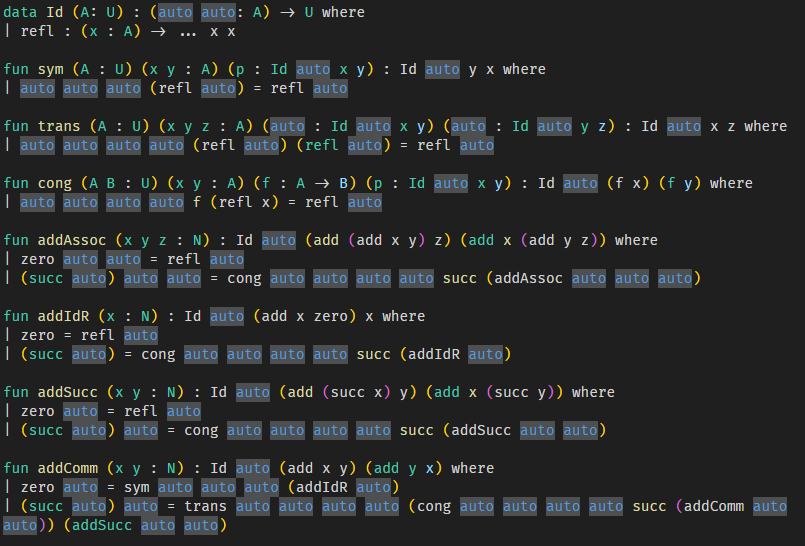

# ShiTT(屎TT)

[English](./README.md) | [中文](./README-zh.md)

ShiTT 是一个屎屎的语言, 支持一些高级依值类型特性.

这里有几篇实现笔记, 如果你对实现模式匹配感兴趣, 或许可以参考,

- [依值类型下的归纳类型和模式匹配的实现笔记](https://konjacsource.github.io/2024/09/02/%E4%BE%9D%E5%80%BC%E7%B1%BB%E5%9E%8B%E4%B8%8B%E7%9A%84%E6%A8%A1%E5%BC%8F%E5%8C%B9%E9%85%8D/)
- [依值类型下模式匹配的完全性检查](https://konjacsource.github.io/2024/09/05/%E4%BE%9D%E5%80%BC%E7%B1%BB%E5%9E%8B%E4%B8%8B%E6%A8%A1%E5%BC%8F%E5%8C%B9%E9%85%8D%E7%9A%84%E5%AE%8C%E5%85%A8%E6%80%A7%E6%A3%80%E6%9F%A5/)

## 用法

编译, 然后加载 shitt 文件, 或者从 [Release](https://github.com/KonjacSource/ShiTT/releases) 中下载已编译好的文件.

```shell
> stack build 
> ./shitt Example.shitt
```

或者从 ghci 中手动加载.

```shell
> stack repl 
ghci> import ShiTT.Parser 
ghci> run "Eaxmple.shitt"
```

## 特性

- [x] 依值类型
- [x] Type in Type
- [x] HOAS 求值.
- [x] 元变量求解和隐式变量
- [x] 代数数据类型和模式匹配
- [x] 模式完全性检查
- [x] 无K的模式匹配
- [x] [语法高亮](https://github.com/KonjacSource/shitt-highlight)
- [x] 高阶归纳类型(暂无边界检查)
- [x] REPL
- [x] 模块系统(非常逊)
- [x] 停机检查
- [x] 互递归
- [ ] 运算符
- [ ] 归纳类型的极性检查
- [ ] 优化输出
- [ ] 优化错误提示
- [ ] 输入输出
- [ ] 编译器后端
- [ ] 类型类

## 使用 REPL

启动 REPL

```shell
> ./shitt repl 
shitt> 
```

或者

```shell
> stack repl 
ghci> import ShiTT.Parser
ghci> repl
shitt> 
```

输入任何 ShiTT 代码, 并以**新一行**的 ";;" 结束

例如

```shell
shitt> data Bool : U where 
shitt> | true : ...  
shitt> | false : ...
shitt> ;;
All Done.
shitt> def not (_ : Bool) : Bool 
shitt> | true = false 
shitt> | false = true
shitt> ;;
All Done.
shitt> #eval not false
shitt> ;;
true
All Done.
```

## 加载文件

现在可以加载文件了

```haskell
#load "FilePath.shitt"

-- 这里可以使用文件中的定义
```

## 语法

### 定义类型

ShiTT 支持类似 Agda 的语法进行类型声明. 比如一些常见的类型

```agda
data Nat : U where 
| zero : ... 
| succ : (_ : Nat) -> ...
```

这相当于如下 Agda 代码

```agda
data Nat : Set where
  zero : Nat 
  succ : Nat -> Nat
```

或如下 Haskell 代码

```haskell
data Nat = Zero | Succ Nat
```

Rust 用户可将其理解为

```rust
enum Nat {
  Zero,
  Succ(Box<Nat>)
}
```

ShiTT 也支持 Indexed Data Types,

```agda
data Vec (A : U) : (n : Nat) -> U where 
| nil : ... zero
| cons : {n : Nat} (x : A) (xs : Vec x n) -> ... (succ n)
```

代码中的 `...` 是占位符. 通常的 Indexed Data Types 的实现都会将待定义类型分成两个部分, 一部分被称为参数, 另一部分被称为下标(Index), 比如在 `Vec` 中, `A` 是参数, `n` 是下表. **类型的每个构造子都必须返回完全一样的类型参数, 但是类型的下标却可以变化**, 所以不管是哪个构造子, 我们都只需要写出类型的下标, 类型的参数部分就成了多余的信息, 便可用 `...` 代之.

所以上述代码相当于 Agda 中的

```agda
data Vec (A : Set) : (n : Nat) -> Set where 
  nil : Vec A zero
  cons : {n : Nat} (x : A) (xs : Vec x n) -> Vec A (succ n)
```

`Vec` 类型可以用来表示定长列表, 比如 `Vec A (succ (succ zero))` 就代表了一个长度为 2 的列表, 类型系统限制了其他长度的列表的类型不会是`Vec A (succ (succ zero))`.

### 定义函数

我们可以使用模式匹配定义函数, 定义函数的关键字可以用 `def` 也可以用 `fun`, 二者没有区别, 并且 `where` 关键字是可选的

```haskell
def add (x y : Nat) : Nat where 
| zero y = y 
| (succ x) y = succ (add x y)
```

然后可以使用 `#eval` 进行求值, 在解析器读到这一行时就会在 stdout 中输出计算结果.
并且可以使用 `#infer` 得到项的类型并输出.

ShiTT 支持依赖模式匹配, 意味着模式匹配中的变量可能会被其他模式确定, 比如

```haskell
data Imf {A B : U} (f : A -> B) : (_ : B) -> U where 
| imf : (x : A) -> ... (f x) 

fun invf {A B : U} (f : A -> B) (y : B) (_ : Imf f y) : A where 
| f _ (imf x) = x  

#eval invf succ (succ zero) (imf zero)
```

这里参数 `y` 就被 `(imf x)` 所确定.

```haskell
#eval add (succ (succ (succ zero))) (succ (succ (succ zero)))
```

### 隐式参数和元变量

正如很多依赖类型编程语言那样, ShiTT 通过元变量来进行类型推导.

比如我们可以定义如下函数来进行列表拼接

```haskell
def append {A : U} {m n : Nat} (v : Vec A m) (w : Vec A n) : Vec A (add m n) 
| nil w = w
| (cons x xs) w = cons x (append xs w)
```

这里大括号中的内容就是隐式参数, 模式匹配时可以自动跳过它们, 调用函数的时候也可以不写.

你也可以像 Agda 中那样手动给出隐式参数, 或者按名给出隐式参数.

ShiTT 使用下划线可以插入一个隐式变量, 如果你不喜欢下划线, 也可以使用 auto 关键字, 这可以让 ShiTT 看起来像是 C++60



手动填写 auto 也很麻烦, 所以我们使用隐式参数让 ShiTT 自动插入 auto.

### HIT

```haskell
higher inductive Int : U where 
| pos : (n : N) -> ... 
| neg : (n : N) -> ... 
    when 
    | zero = pos zero
#infer Int -- : U 
#eval neg zero -- = pos zero
```

### 公理

这样定义公理

```haskell
axiom def lem {A : U} : Either A (A -> Void)
```

### 不可匹配类型

```haskell
unmatchable data Interval : U where 
| i0 : ... 
| i1 : ...

-- 这没问题
def reflTrue (i : Interval) : Bool 
| i = true

-- 这里产生一个错误, 因为试图对 Interval 进行匹配
def trueToFalse (i : Interval) : Bool
| i0 = true 
| i1 = false

-- 但这种定义是可以的, 因为 when 子句不会进行完全性检查
higher inductive S1 : U where 
| base : ... 
| loop : (i : Interval) -> ... 
    when 
    | i0 = base 
    | i1 = base
```

### 定理证明?

ShiTT 不是一个 PA, 所以这里直接使用了 Type in Type, 并且将来可能考虑不添加终止检查.

## 其他语法

### Let 绑定

```haskell
#eval let x : Nat = succ zero ; add x x
```

### Lambda 表达式

```haskell
#eval \ x . add (succ zero) x
```

### 按名应用隐式参数

```haskell
#eval Id {A = Nat}
```

### 输出环境

```haskell
fun addComm (x y : N) : Id (add x y) (add y x) where 
| zero y = sym (addIdR _)
| (succ x) y = traceContext[  trans (cong succ (addComm x y)) (addSucc y x)  ]
```

`traceContext` 会输出环境中的变量以及目标类型 (如果它明确的话), 注意到 `traceContext[x] = x`.

## 例子

如下的例子展示了定义类型与函数的基本语法, 并展示了如何证明加法结合律和交换律.

```haskell
data Id {A : U} : (_ _ : A) -> U where 
| refl : (x : A) -> ... x x

def uip {A : U} {x y : A} (p q : Id x y) : Id p q where 
| (refl _) (refl x) = refl (refl _)

data N : U where  
| zero : ...  
| succ : (pre : N) -> ...  

def add (m n : N) : N where  
| zero n = n
| (succ m) n = succ (add m n)

data Vec (A : U) : (_ : N) -> U where 
| nil : ... zero 
| cons : {n : N} (x : A) (xs : Vec A n) -> ... (succ n)

#infer Vec

def append {A : U} {m n : N} (v : Vec A m) (w : Vec A n) : Vec A (add m n) 
| nil w = w
| (cons x xs) w = cons x (append xs w)

#eval append (cons zero (cons (succ zero) nil)) nil

-- Some theorems.

def sym {A : U} {x y : A} (p : Id x y) : Id y x where 
| (refl _) = refl _

def trans {A : U} {x y z : A} (_ : Id x y) (_ : Id y z) : Id x z where 
| (refl _) (refl _) = refl _ 

def cong {A B : U} {x y : A} (f : A -> B) (p : Id x y) : Id (f x) (f y) where 
| f (refl x) = refl _

def addAssoc (x y z : N) : Id (add (add x y) z) (add x (add y z)) where 
| zero y z = refl _
| (succ x) y z = cong succ (addAssoc x y z) 

def addIdR (x : N) : Id (add x zero) x where 
| zero = refl _ 
| (succ x) = cong succ (addIdR x)

def addSucc (x y : N) : Id (add (succ x) y) (add x (succ y)) where 
| zero y = refl _ 
| (succ x) y = cong succ (addSucc x y)

def addComm (x y : N) : Id (add x y) (add y x) where 
| zero y = sym (addIdR _)
| (succ x) y = trans (cong succ (addComm x y)) (addSucc y x)

```
